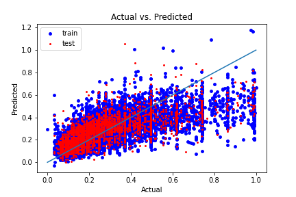

# Predicting AirBnB prices
Work in progress! Please accept my apologies for any lack of clarity, bug, or typo.

# Table of contents
1. [Introduction](#Introduction)
    1.1 [Background](#Background)
    1.2 [Business problem statement](#Business%20problem%20statement)

2. [Data preprocessing and Exploratory Data Analysis](#Data%20preprocessing%20and%20Exploratory%20Data%20Analysis)
    2.1. [Feature scaling and engineering](#Feature%20scaling%20and%20engineering)
    2.2. [Outliers and inter-correlation between features](#Outliers%20and%20inter-correlation%20between%20features)

## Introduction
### Background

After the 2008 financial crisis, the United States government created a new program that allowed institutional investors such as hedge and private-equity funds to directly purchase large quantities of foreclosed homes. Between 2011 and 2017, they purchased over 200,000 of these.  One of the challenges of purchasing such large portfolios of new assets is determining the appropriate valuation. During a similar time frame, a new technology company called AirBnB created a new platform that allowed owners of individual housing units to rent out spare rooms or entire units to compete against hotels. As this platform grew, it generated new data that could be used to value the types of housing units purchased by the institutional investors. The key to such valuations is a model that could accurately predict the price of an overnight stay.  This model could then be used to value these assets by a Discounted Cash Flow model. 

### Business problem statement

The real estate market in the city of Toronto is down, and a hedge fund is considering purchasing and then renting housing units to make a profit in the short term while waiting for the market to bounce back before selling the units. I am tasked with determining: 1) how accurate can the price of overnight stays at AirBnb properties be predicted, and 2) what dictates the price? Property type? The number of people it can accommodate? Distance from the center? Review score? Cancellation policy?"

## Data preprocessing and Exploratory Data Analysis

Data was downloaded from "insideairbnb.com". The original dataset contained more than one-hundred features and twenty-thousand observations. Some of the features, however, did not have any predictive value (for example, those containing URLs), while some others had numerous (more than ninety percent) missing values for the price column. There were also text features (for example property description). These features can be expected to have some predictive value, but utilizing them would require sentiment analysis, which is beyond the scope of this project. Therefore, they were also dropped. The cleaned dataset contained features displayed below. I should also mention that the original dataset contained a 'square_feet' column; however, more than ninety percent of its values were missing so that column was also dropped.  
 

 

### Feature scaling and engineering

Among the categorical features, 'room_type' and 'cancellation_policy' are encoded using ordinal encoding because they can be reasonably expected to have a natural order with respect to the price (for example, a property with a more flexible cancelation is likely to have a higher price). The other categorical features are encoded using get_dummies. More advanced encoding methods were not used because the data set was low-cardinality. 

Numerical features were scaled using normalization. Among the ML models that are trained, only the Linear Regression (and not the tree-based models) can be, to some extent, influenced by the choice of the scaling method. I tried standardization method as well and noticed that it gives virtually the same result as normalization.  

The dataset contains latitude and longitude features. It can be reasonably expected that the distance of a property to the city center is more important in predicting the price than its latitude or longitude. Therefore, the latter features are used to engineer a new distance feature and then dropped.

### Outliers and inter-correlation between features

Exploratory Data Analysis (EDA) was performed on the cleaned and preprocessed dataset to identify outliers and to inspect the inter-correlation between features. The box-and-whisker diagrams and Inter Quartile Range (IQR) method were used to identify the major outliers: points that fall beyond the outer upper fence, which is the Q3 + 3*IQR. The method is used instead of more complex methods, such as DBSCAN and Isolation Forests, due to its simplicity and instead of the Z-score method because the latter method assumes Gaussian distribution of the underlying data. The outliers were eliminated because they corresponded to less than fifteen percent of the observations and I noticed that keeping them severely deteriorates the performance of the models.

Analysing the inter-correlation (i.e., pairwise correlation) between the features shows that there is a strong correlation between features 'accommodates', 'bedrooms' (with Pearson correlation coefficient 0.7) and between features 'accommodates', 'bed' (with coefficient 0.79), which indicates that they contain redundant information. Among these features, only 'accommodates' is kept because that feature can be expected to have a more direct relationship with the target variable price than the two other features. 

### Building the models
Linear Regression and different tree-based regression models were trained. 

#### Feature selection

For all the trained models, features selection is performed using scikit learn's Recursive Feature Elimination (RFE) class. RFE fits a given model and then removes the least important feature. It then continues this process until the user-specified number of features, n_f, is reached. Each model is trained using different values of n_f to determine the minimum value at which the model reaches it maximum performance. 

#### Hyper-parameter tunning
The hyper-parameters of the tree-based models are tunned using scikit learn's GridSearchCV. The class takes a model, a hyper-parameter grid, and a cross-validation strategy (for example, K-fold). It then splits the data into K-folds and, for each point in the grid, calculates the test score for every split. The point that has the highest average test score (i.e., test score averaged over all the splits) determines the values of the tunned hyper-parameters. GridSearchCV was used instead of RandomizedSearchCV because I noticed that the number of hyper-parameters that had any noticeable impact on the performance is relatively low so performing an exhaustive search was still possible.

### Results

#### Linear Regression (LR)

The first trained model is a Linear Regression (LR) with coefficients determined using Ordinary Least Squares. This model is trained as a baseline so that predictions of the tree-based models can be compared against it. Any LR model should satisfy the following four assumptions: errors should have a 1) zero mean and 2) constant variance (homoskedastic) and should be 3) uncorrelated and 4) normally distributed. The predicted prices as a function of the actual prices for the training and test datasets and the Root Mean Squared Error (RMSE) and R2 score of the LR model on the train, test, and holtout sets are displayed below

It can be seen that the model generalizes reasonably well to the test and holdout sets. To examine this assumption....

The analysis shows that LR prediction errors are heteroskedastic and non-normal: two of the underlying assumptions are violated. 

Therefore, LR with ordinary least squares does not seem to be appropriate for the dataset in its current form. While there are methods to tackle the problems associated with violating the underlying assumptions, such as using weighted least squares or transforming the dataset, exploring those potential solutions is left for future projects and here we continue with tree-based regression models. Despite the violations in its underlying assumptions, LR was able to reach an R-squared score of about 0.42, and including more than seven features (out of fifteen) in training had virtually no impact on that score. 

Next, tree-based models were explored. The first one was the decision tree. After tunning (with cross-validation) its hyper-parameters, it was found that the only hyper-parameter whose tunning had a significant impact on the prediction scores was the maximum depth. In tunning, the search space for a parameter contained at least three values and, through trial and error, it was ensured that the space is wide enough such that the final tunned value is lower/higher than (not equal to) the upper/lower bounds of the search space. The R-squared test score of the decision tree increased smoothly as the number of features increased from two to eight but then it saturated at 0.5 (twenty percent higher than LR). 

## Business insights obtained from data

Visualizing the tree revealed a business insight drawn from the data. It showed that, regardless of the number of selected features, the first split of the tree is based on whether the place is a private room or an entire home/apartment. For private rooms, the second split is based on the distance to the center. That means that for people who are looking for private rooms, the most important point is how far the room is from the center. For apartments, the second split is based on the number of people that the place can accommodate and not the distance. People who want to stay at an apartment will probably have a car too, so form them, the distance from the center is not as important. 

After training a decision tree, different ensemble methods were explored. The first one was the Random Forest (RF). In tunning its hyper-parameters, it was noticed that the best R_squared score is achieved when the maximum depth of the tress is unlimited and a very high number of estimators, n_estimator, is used. In fact, in the tunning trials I performed, the final tunned value of n_estimator was always the upper bound of my search space. Nontheless, n_estimator had to be limited (to less than 200) due to the limitations in available computational resources. Similar to the single tree, R-squared test score of RF increased smoothly as the number of features increased from two to eight but then it saturated at 0.54, eight percent higher than a single tree. However, that accuracy gain was at the cost of more than hundred-fold (~ number of estimators) increase in the computational time.  

The next ensemble methods used were Xtreme Gradient Boosting (XGBoost) and Light Gradient Boosting (LGBoost). These methods use optimized implementations of Gradient Boosting (for details, see the notebook). They were found to be about thirty times faster to train than the RF, 
but their final R-squared test score were similar. Nonetheless, the fact that they are fast allowed performing a higher-dimensional grid search. That search, however, did not result in any significant improvements in the R-squared test score.

## Conclusions and future work

Different algorithms, including LR, DT, RF, XGBoost, and LGBoost were trained to predict Airbnb rental prices. The highest R-squared test score (around 0.53) was obtained using the ensemble methods (RF, XGBoost, and LGBoost). Among the latter methods, XGBoost and LGBoost were found to be thirty times faster to train than RF. The most important feature was found to be the room_type: entire home/apt or private room. The next most important feature for entire home/apts and private rooms were found to be, respectively, the number of people that can be accomodated and the distance from the city center. Althuogh the dataset used for training had 16 features, including features other than 'bathrooms', 'accommodates', 'cleaning_fee', 'room_type', 'distance' did not imporve the scores. The scores may be further improved by including text features that exist in the dataset in the form of comments or descriptions. This is left for a future project.

## Description of the code structure

The notebook contains an object-oriented code, developed using Scikit-learn, that builds linear and tree-based regression models. The code consists of the following seven classes:

<ins>CleanData</ins>: contains all the methods responsible for cleaning data, such as: replacing symbols, standardizing letters, and converting data types.
<ins>ExploreData</ins>: contains methods responsible for exploring data such as printing summary information.
PreprocessData</ins>: contains methods responsible for preprocessing data, such as encoding/scaling catagorical/numerical variables 

<ins>EDA</ins>: This is the class that performs the actual explatory data analysis and it inherits the methods implemented in the above classes. 

<ins>SelectFeatures</ins>: An "abstraact" class that implements recursive feature elimination. 
<ins>BuildModelAfterSelectingFeatures</ins>: This class inherits from the SelectFeatures class, performs the actual feature selection, builds the model, performs hyper-parameter tunning, and makes predictions.

<ins>EvaluateTheModel</ins>: this class implements all the methods responsible for evaluating different models, such as calculating RMSE and r2 scores and methods that check whether the underlying assumptions of linear regress are satisfied. 

### Further Readings 
XGBoost:  
    Original paper: https://arxiv.org/pdf/1603.02754.pdf 
    Documentation: https://xgboost.readthedocs.io/en/latest/ 
    Nice blog post: https://machinelearningmastery.com/gentle-introduction-xgboost-applied-machine-learning/ 

LightGBM: 
    Original paper: https://www.microsoft.com/en-us/research/wp-content/uploads/2017/11/lightgbm.pdf 
    Documentation: https://lightgbm.readthedocs.io/en/latest/Features.html 
    A nice blog post: https://docs.microsoft.com/en-us/archive/blogs/machinelearning/lessons-learned-benchmarking-fast-machine-learning-algorithms 

Style:  
    https://legacy.python.org/dev/peps/pep-0008/#other-recommendations 

## Instructions to continue

If you would like to run the notebook, first download the csv file (containing Airbnb listings.csv) and then set the variable "CSV_local_address" in the second cell of the notebook to the local addrress of the downloaded file.

## Requirements
Python 3.6  
Scikit-learn 
Pandas 
Numpy 
seaborn 
scipy 
statsmodels 