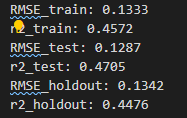
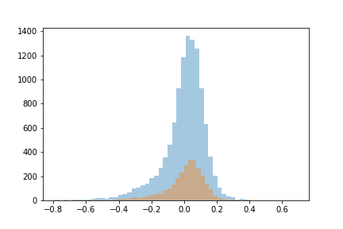
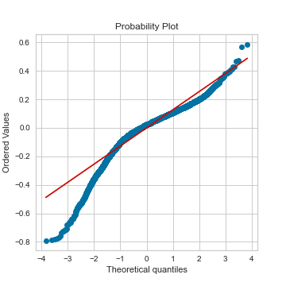
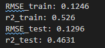
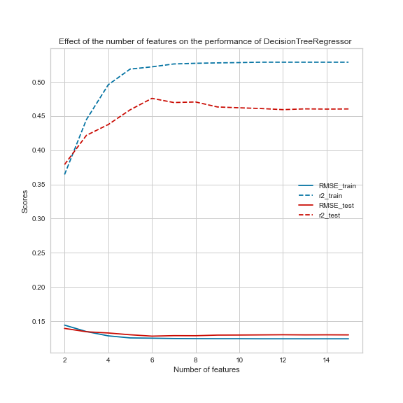

## Table of contents
1. [Introduction](#Introduction) 
    1.1 [Background](#Background) 
    1.2 [Business problem statement](#Business%20problem%20statement) 

2. [Data preprocessing and Exploratory Data Analysis](#Data%20preprocessing%20and%20Exploratory%20Data%20Analysis) 
   1. [Feature scaling and engineering](#Feature%20scaling%20and%20engineering) 
   2. [Outliers and inter-correlation between features](#Outliers%20and%20inter-correlation%20between%20features) 

3. [Building the models](#Building%20the%20models) 
   1. [Feature selection](#Feature%20selection) 
   2. [Hyper-parameter tunning](#Hyper-parameter%20tunning) 

4. [Results](#Results) 
   1. [Linear Regression (LR)](#Linear%20Regression%20(LR)) 
   2. [Tree-based regressors](#Tree-based%20regressors) 
      1. [Decision tree](#Decision%20tree) 
      2. [Random forest](#Random%20forest) 
      3. [Optimized gradient boosting](#Optimized%20gradient%20boosting) 
5. [Conclusions](#Conclusions) 

## Introduction
### Background

After the 2008 financial crisis, the United States government created a new program that allowed institutional investors such as hedge and private-equity funds to directly purchase large quantities of foreclosed homes. Between 2011 and 2017, they purchased over 200,000 of these.  One of the challenges of purchasing such large portfolios of new assets is determining the appropriate valuation. During a similar time frame, a new technology company called AirBnB created a new platform that allowed owners of individual housing units to rent out spare rooms or entire units to compete against hotels. As this platform grew, it generated new data that could be used to value the types of housing units purchased by the institutional investors. The key to such valuations is a model that could accurately predict the price of an overnight stay. This model could then be used to value these assets by a Discounted Cash Flow model. 

### Business problem statement

The real estate market in the city of Toronto is down, and a hedge fund is considering purchasing and then renting housing units to make a profit in the short term while waiting for the market to bounce back before selling the units. I am tasked with determining: 1) how accurate can the price of overnight stays at AirBnb properties be predicted, and 2) what dictates the price? Property type? The number of people it can accommodate? Distance from the center? Review score? Cancellation policy?"

## Data preprocessing and Exploratory Data Analysis

Data was downloaded from "insideairbnb.com." The original dataset contained more than one-hundred features and twenty-thousand observations. Some of the features, however, did not have any predictive value (for example, those containing URLs), while some others had numerous (more than ninety percent) missing values for the price column. There were also text features (for example, property description). These features can be expected to have some predictive value, but utilizing them would require sentiment analysis, which is beyond the scope of this project. Therefore, they were also dropped. The cleaned dataset contained features displayed below. I should also mention that the original dataset contained a 'square_feet' column; however, more than ninety percent of its values were missing, so that column was also dropped.  
 

 

### Feature scaling and engineering

Among the categorical features, 'room_type' and 'cancellation_policy' are encoded using ordinal encoding because they can be reasonably expected to have a natural order with respect to the price (for example, a property with a more flexible cancellation is likely to have a higher price). The other categorical features are encoded using get_dummies. More advanced encoding methods were not used because the data set was low-cardinality. 

Numerical features were scaled using normalization. Among the ML models that are trained, only the Linear Regression (and not the tree-based models) can be, to some extent, influenced by choice of the scaling method. I tried the standardization method as well and noticed that it gives virtually the same result as normalization.  

The dataset contains latitude and longitude features. It can be reasonably expected that the distance of a property to the city center is more important in predicting the price than its latitude or longitude. Therefore, the latter features are used to engineer a new distance feature and then dropped.

### Outliers and inter-correlation between features

Exploratory Data Analysis (EDA) was performed on the cleaned and preprocessed dataset to identify outliers and to inspect the inter-correlation between features. The box-and-whisker diagrams and Inter Quartile Range (IQR) method were used to identify the major outliers: points that fall beyond the outer upper fence, which is the Q3 + 3*IQR. The method is used instead of more complex methods, such as DBSCAN and Isolation Forests, due to its simplicity and instead of the Z-score method because the latter method assumes Gaussian distribution of the underlying data. The outliers were eliminated because they corresponded to less than fifteen percent of the observations, and I noticed that keeping them deteriorates the performance of the models.

Analysis of the inter-correlation (i.e., pairwise correlation) between the features shows that there is a strong correlation between features 'accommodates,' 'bedrooms' (with Pearson correlation coefficient 0.7) and between features 'accommodate,' 'bed' (with coefficient 0.79), which suggests that they contain redundant information. Among these features, only 'accommodates' is kept because that feature can be expected to have a more direct relationship with the target variable price than the two other features.

## Building the models

Linear Regression and different tree-based regression models were trained. 

### Feature selection

For all the trained models, features selection is performed using scikit-learn's Recursive Feature Elimination (RFE) class. RFE first fits a given model using all the features and then removes the least important one. It then continues this process until the user-specified number of features, n_f, is reached. Each model is trained using different values of n_f to determine the minimum value at which the model reaches its maximum performance.

### Hyper-parameter tunning

The hyper-parameters of the tree-based models are tunned using scikit-learn's GridSearchCV. The class takes a model, a hyper-parameter grid, and a cross-validation strategy (for example, K-fold). It then splits the data into K-folds and, for each point in the grid, calculates the test score for every split. The point that has the highest average test score (i.e., test score averaged over all the splits) determines the values of the tunned hyper-parameters. GridSearchCV was used instead of RandomizedSearchCV because I noticed that the number of hyper-parameters that had any noticeable impact on the performance is relatively low so performing an exhaustive search was still possible.

## Results

### Linear Regression (LR)

The first trained model is a Linear Regression (LR) with coefficients determined using Ordinary Least Squares (OLS). The reason that OLS is used instead of the more advanced methods, such as Elastic-Net or Least Angle Regression that are also available in scikit-learn, is that LR is intended to be used only as a baseline model so that the predictions of the tree-based models can be compared against it. 

The predicted prices as a function of the actual prices for the training and test datasets and the Root Mean Squared Error (RMSE) and R2 score of the LR model on the train, test, and holdout sets are displayed below

 

 

It can be seen that the R2 scores on training, test, and holdout sets are essentially equal, which shows that the model generalizes very well.  

Before discussing the tree-based models, I should mention that any LR model should satisfy the following four assumptions: errors should have a 1) zero mean and 2) constant variance (homoskedastic) and should be 3) uncorrelated and 4) normally distributed. If you would like to learn more about these assumptions and why they need to be satisfied, you can continue reading this section; otherwise, you can safely skip to the next one.

The reason we need to ensure that the underlying assumptions of LR are satisfied is, in that case, according to a well-known statistical theorem, known as Gauss-Markov, OLS will produce the Best Linear Unbiased Estimator; in other words, our estimator will be BLUE.  

There are different ways to check whether the errors (predictions - the actual values) are normally distributed or not. The simplest way is to plot the distribution of errors on both the training and test datasets, using, for example, the seaborn package's "distplot" function 

 

A more advanced way is to make a normal Quantile-Quantile (QQ) plot using probplot function of the stat module of scikit-learn. To make a QQ plot of a sample, first, the values in the sample need to be sorted. Then, the sorted values (sample quantiles) are plotted against appropriate quantiles from the standard normal distribution. The latter quantiles are obtained by dividing the probability density function of the distribution into n + 1 equal areas, where n is the size of the sample. In other words, in a QQ plot, the ith ordered value of the sample is plotted against the i/(n+1) quantile of a normal distribution (typically standard). The QQ plot of the errors of the LR model is displayed below

 

It can be seen that the errors are not normally distributed mainly because the smallest negative error values are more extreme than they would have been if the errors were normal. Error non-normality indicates that the model is biased, therefore not BLUE, and is typically the result of a violation in one of the other assumptions of LR (such as homoscedasticity) or the presence of strong outliers. 

A more formal way to check error normality is to perform a statistical hypothesis testing known as Anderson-Darling test. The test checks whether a given sample is drawn from a given probability distribution (null hypothesis). The test is already implemented in the statsmodels module of Python. Performing the test on our dataset resulted in a p-value lower than 0.05, which, again, confirms that the errors are not normally distributed. 

To check whether the errors are homoskedastic or not, I plot the errors against the predicted values as shown below

 

It is evident that the errors are not homoskedastic because if they were, different points would have had a random uniform distribution against the target value. Of course, there are more formal ways of checking for homoskedasticity, such as performing Breush-Pagan or Goldfeld-Quandt tests, but I did not pursue them here because the above figure already clearly reveals that the errors are not homoskedastic. This again indicates that the LR model is biased, therefore not BLUE. 

To check whether the errors are correlated or not, I performed the Durbin-Watson test. The null hypothesis is that there is no autocorrelation, and the test reports a statistic that is between 0 and 4. A value of less than two will indicate that there is no correlation. Correlated errors will indicate that there is an important feature that is not taken into account in building the estimator and, therefore, its effect is coming in through the error terms. As a result, there has to be another estimator that is better than the current one: our current estimator is not BLUE. Performing the test revealed that the errors are not correlated.

From the above discussion, it can be concluded that LR with OLS is not appropriate for the dataset in its current form. While there are methods to tackle the problems associated with violations in the underlying assumptions, such as using weighted least squares or transforming the dataset, exploring those potential solutions is not pursued here because, again, LR was intended to serve as a baseline model such that the performance of the tree-based models can be compared against. 

The next issue is understanding how the performance of the LR changes with the number of included features. The plot below shows the variations of RMSE and R2 scores on the training, test, and holdout sets with the number of features.

 

It can be seen that including more than six features has virtually no impact on the scores, and the maximum R2 test score that LR can achieve is about 0.45. 

### Tree-based regressors

#### Decision tree

The first tree-based regressor is the decision tree. After performing numerous hyper-parameter tunning (with cross-validation) trials, I found that the main hyper-parameter, whose tunning has a significant impact on the scores, is the maximum depth. Also, in tunning, the search space for a parameter contained at least three values and, through trial and error, I ensured that the space is wide enough such that the final tunned value is lower/higher than (not equal to) the upper/lower bounds of the search space. Including all the features, a tunned decision tree has the following performances

 

As shown below, the R-squared test score of the decision tree increases smoothly as the number of features increases from two to five, but then it saturates at around 0.47, which is only four percent higher than the maximum test score achieved by the LR.

 

To address the second task of this project (i.e., understanding what dictates the price), I visualized the decision tree, as shown below.

 

It can be seen that the first split is based on whether the place is a shared/private room or an entire apartment. For the shared/private rooms, the second split is based on the distance to the center, indicating that for customers interested in such rooms, the most important point is how far the room is located from the city center. However, for customers who are interested in an entire apartment, the most important point is the number of bathrooms and not the distance. This is reasonable because people who want to stay at an apartment will probably have a car too, so for them, the distance to the center will not matter as much.

Next, different ensemble methods are explored. 

#### Random forest

The first ensemble model that is trained is the Random Forest (RF). In tunning its hyper-parameters, I noticed that the best R_squared score is achieved when the trees' maximum depth is unlimited, and a very high number of estimators, n_estimator, is used. In fact, in the tunning trials I performed, the final tunned value of n_estimator was always the upper bound of my search space. Nonetheless, n_estimator had to be limited (to less than 200) due to the limitations in available computational resources. Including all the features, a tunned random forest has the following performances

 

As shown below, the R-squared test score of RF increases smoothly as the number of estimators increases until about twenty, but it then saturates at 0.52, thirteen percent higher than a single tree. However, that accuracy gain was at the cost of an increase in the computational time that was (almost) proportional to the number of estimators. To gain such an accuracy increase with no significant increase in the computational time, one can use optimized gradient boosting algorithms, which are discussed next.

 

#### Optimized gradient boosting

The two gradient boosting methods used in this project are Xtreme Gradient Boosting (XGBoost) and Light Gradient Boosting (LGBoost). Boosting refers to the idea of combining sequentially multiple weak learners (a learner that has a performance slightly better than random chance) into a strong one, where each weak learner is trying to correct its predecessor. Gradient boosting methods are those that recast boosting into a numerical optimization problem and use methods such as gradient descent (hence the name gradient boosting) to minimize a loss function. Each predictor tries to minimize the residual error made by its previous predictor. The final prediction is simply the sum of the predictions of all the individual learners. XGBoost and lightGBM are examples of the gradient boosting methods for decision trees. They both grow the tree leaf-wise rather than level-wise, and their difference is in the specifics of optimization. 

For the current dataset, LGBoost and XGBoost gave R-squared test scores that were similar to RF. However, their computational times were about 10 and 2 times lower than the RF.

## Conclusions

To help a hedge fund, who is considering purchasing and then renting a collection of housing units in the city of Toronto evaluate the value of the properties as accurately as possible, I built models to predict the price of overnight AirBnB stays, using different algorithms: Linear Regression, Decision Tree, Random Forest, XGBoost, and LGBoost were used. I found that using features that do not require sentiment analysis, the highest achievable R-squared test score is about 0.53 and is obtained using either of the RF, XGBoost, or LGBoost ensemble methods, with the latter method being the fastest one to train. I also found that the most important feature is the room_type (shared/private room or entire home/apt). The second most important feature is the distance to the city center for customers interested in shared/private rooms and the number of bathrooms for the ones interested in an entire home/apt. Although sixteen features were available in the dataset, including features other than 'room_type,' 'distance,' 'bathrooms,' 'accommodates,' and 'cleaning_fee' did not improve the scores. 

It can be expected to further improve the highest R-squared test score achieved here by including features in the original dataset that require sentiment analysis. However, that improvement will still be limited mainly because of the nature of Airbnb pricing. The prices on Airbnb are host listings and do not necessarily indicate that they are accepted by the buyers. In other words, they are not wetted prices; therefore, they can be artificially high. Such artifacts in the dataset will make it practically impossible to achieve highly accurate price predictions regardless of the methods used. Nonetheless, the models trained here can still be used to provide supplementary information for financial decision-makers.

### Further Readings 
XGBoost:  
    Original paper: https://arxiv.org/pdf/1603.02754.pdf 
    Documentation: https://xgboost.readthedocs.io/en/latest/ 
    Nice blog post: https://machinelearningmastery.com/gentle-introduction-xgboost-applied-machine-learning/ 

LightGBM: 
    Original paper: https://www.microsoft.com/en-us/research/wp-content/uploads/2017/11/lightgbm.pdf 
    Documentation: https://lightgbm.readthedocs.io/en/latest/Features.html 
    A nice blog post: https://docs.microsoft.com/en-us/archive/blogs/machinelearning/lessons-learned-benchmarking-fast-machine-learning-algorithms 

Style:  
    https://legacy.python.org/dev/peps/pep-0008/#other-recommendations 

