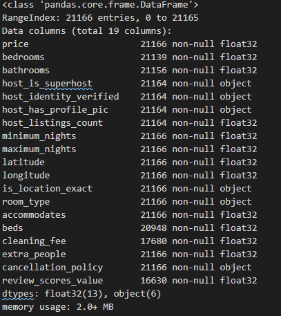

## Table of contents
1. [Business Problem Statement](#Business-Problem-Statement) 
2. [Background](#Background) 
3. [Key Findings](#Key%20Findings) 
4. [Data Collection](#Data%20Collection) 
5. [Data Preprocessing](#Data%20Preprocessing) 
6. [Exploratory Data Analysis (EDA)](#Exploratory%20Data%20Analysis%20(EDA)) 
   1. [Detecting Confounders](#Detecting%20Confounders) 
   2. [Distribution Analysis](#Distribution%20Analysis) 
   3. [Handling Outliers](#Handling%20Outliers) 
7. [Feature Engineering](#Feature%20Engineering) 
   1. [Feature Scaling/Encoding](#Feature%20Scaling/Encoding) 
   2. [Feature Creation](#Feature%20Creation) 
   3. [Feature Selection](#Feature%20Selection) 
8. [Model Building](#Model%20Building) 
   1. [Linear Regression (LR)](#Linear%20Regression%20(LR)) 
      1. [Estimating Coefficients](#Estimating%20Coefficients) 
      2. [OLS Assumptions](#OLS%20Assumptions) 
      3. [Meeting OLS Assumptions](#Meeting%20OLS%20Assumptions) 
      4. [Model Performance Evaluation](#Model%20Performance%20Evaluation) 
      5. [Feature Importance](#Feature%20Importance) 
   2. [Decision Tree (DT)](#Decision%20tree) 
   3. [Random Forest (RF)](#Random%20forest) 
   4. [Optimized Gradient Boosting](#Optimized%20gradient%20boosting) 
9.  [Conclusions](#Conclusions) 
10. [Further Code Improvements and Future Work](#Further%20Code%20Improvements%20and%20Future%20Work) 
11. [Further Readings](#Further%20Readings) 

## Business Problem Statement

The real estate market in the city of Toronto is down, and a hedge fund is considering purchasing and then renting housing units to make a profit in the short term while waiting for the market to bounce back before selling the units. I am tasked with determining: 1) how accurate can the price of overnight stays at AirBnb properties be predicted, and 2) what dictates the price? Property type? The number of people it can accommodate? Distance from the center? Review score? Cancellation policy?"

## Background

After the 2008 financial crisis, the United States government created a new program that allowed institutional investors such as hedge and private-equity funds to directly purchase large quantities of foreclosed homes. Between 2011 and 2017, they purchased over 200,000 of these.  One of the challenges of purchasing such large portfolios of new assets is determining the appropriate valuation. During a similar time frame, a new technology company called AirBnB created a new platform that allowed owners of individual housing units to rent out spare rooms or entire units to compete against hotels. As this platform grew, it generated new data that could be used to value the types of housing units purchased by the institutional investors. The key to such valuations is a model that could accurately predict the price of an overnight stay. This model could then be used to value these assets by a Discounted Cash Flow model. 

## Key Findings

1) Analyzing data to draw business insights revealed that:
   
   1) On average, the rental price for an entire apartment is about 17 percent higher than of a hotel room, which is itself, again on average, about two times higher than the price of a private/shared room. 
   
   2) For customers interested in a shared/private room, the most important factor is the distance from the city center. For those interested in an entire apartment, that factor is the number of bathrooms. 

2) OLS Linear regression is not appropriate for the date set in its current format because homoscedasticity and error normality assumptions are not satisfied. 

3) Without sentiment analysis, the maximum achievable R2 score is less than 0.6.

## Data Collection

Data was downloaded (on 24th of Sep. 2020) from "insideairbnb.com," which is a website that provides AirBnB data for different cities around the world in CSV format. The downloaded file contained information about property, neighbourhood, review scores, host, etc and had more than twenty-thousand observations and one-hundred features. Most of these features, however, had to be dropped in the data preprocessing stage for reasons that are discussed next.

## Data Preprocessing

Some of the features in the downloaded file did not have any predictive value (for example, those containing URLs), while some others had numerous (more than ninety percent) missing values for the price column. There were also text features (for example, property description). These features can be expected to have some predictive value, but utilizing that value would require sentiment analysis, which is beyond the scope of this project. Therefore, text features were also dropped. I should emphasize that the downloaded file contained a 'square_feet' column as well, but more than ninety percent of its values were missing, so that column was also dropped. There were also features with the same value for all the rows, which also needed to be dropped. Some columns contained symbols such as '$', ',' that needed to be removed and numerical columns were all converted to float32.  

Finally, the cleaned dataset contained features displayed below.  

 

## Exploratory Data Analysis (EDA)

The cleaned and preprocessed dataset was used to perform Exploratory Data Analysis (EDA) in the following stages. 

### Detecting Confounders

Analysis of the inter-correlation (i.e., pairwise correlation) between the features showed that there is a strong correlation between features 'accommodates,' 'bedrooms' (with Pearson correlation coefficient 0.7) and between features 'accommodate,' 'bed' (with coefficient 0.79), which suggests that they contain redundant information. Among these features, only 'accommodates' is kept because that feature can be expected to have a more direct relationship with the target variable price than the two other features.

### Distribution Analysis

Feature ‘accommodates’ had a multimodal right-skewed distribution with the first/second/third modes corresponding to 2/4/6. The first mode was about 2/4 times more pronounced than the second/third ones. The mean/median/standard deviation of the distribution were equal to 3.1/2/2.07.

Among features 'bathrooms‘/'bedrooms‘/'beds‘, features 'bedrooms‘/'beds‘ had right-skewed unimodal distributions centered at 1, indicating that most properties are single bedroom with a single bed. The feature 'bathrooms’, however, had a bimodal distribution with the first/second modes at 1/2. The reason the latter distribution was bimodal, instead of unimodal, was that some properties had an additional shared bathroom (which made the value of the feature 1.5).  The mean/median/standard deviation of features  'bathrooms‘, 'bedrooms‘, and 'beds‘ were 1.26/1.0/0.57, 1.32/1.0/0.87, and 1.66/1.0/1.12, respectively. 

Feature 'cleaning_fee’ had a right-skewed multimodal distribution with the first and second modes between $45-50 and 95-100, respectively. The mean/median/standard deviation of the distribution were $62.1/50 /51.9. 

Feature ‘extra_people’ (representing the cost of an additional person per night) had a multimodal right-skewed distribution with the first/second/third modes at 0/20/10 and with the first mode about five times more pronounced than the second/third ones. The mean/median/standard deviation of the distribution were $3.52/0/124.88. Feature ‘host_total_listings_count’ had a unimodal right-skewed distribution with mean/median/standard deviation of 8.74/1/97.00. Such relatively high values for the mean and standard deviation (compared to the median) suggest the presence of outliers in these two features. For example, for the latter feature, those high values  were found to be due to a few observations having the unreasonably high value of 3038, which is likely to be due to some kind of error. 

Feature 'maximum_nights‘ had a left-skewed bimodal distribution where the first/second modes were the overflow/underflow bins corresponding to greater/less than 365/30, with the first mode about three times more pronounced than the second one. This indicates that the majority of the properties allow effectively infinite number of overnight stays per booking. Among the remaining ones, the majority allow stays of up to a month. Feature 'minimum_nights‘ had a right-skewed bimodal distribution where the first and second modes were at 1 and at the overflow bin corresponding to greater than 7. 

Finally, the target feature ‘price’ had a multimodal distribution with the first and second modes around $90-100 and $40-50, respectively. The mean/median/standard deviation of the feature were $ 143/100/280. Such relatively high values for the mean and standard deviation (compared to the median) were due to outlier properties that had overnight stay prices of above $900! The procedure to deal with the outliers is discussed next. 

### Handling Outliers

These outliers were identified using box-and-whisker diagrams and the Inter Quartile Range (IQR) method. In this method, points that fall beyond the outer upper fence, which is the Q3 + 3*IQR, are assumed to be outliers. The method is used instead of more complex methods, such as DBSCAN and Isolation Forests, due to its simplicity and instead of the Z-score method because the latter method assumes Gaussian distribution of the underlying data. The outliers were eliminated because they corresponded to less than fifteen percent of the observations, and I noticed that keeping them deteriorates the performance of the models. 

## Feature Engineering

### Feature Scaling/Encoding

Numerical features were scaled using normalization. Among the ML models that are trained, only the Linear Regression (and not the tree-based models) can be, to some extent, influenced by choice of the scaling method. I tried the standardization method as well and noticed that it gives virtually the same result as normalization.  

Among the categorical features, 'room_type' and 'cancellation_policy' were encoded using ordinal encoding because they can be reasonably expected to have a natural order with respect to the price (for example, a property with a more flexible cancellation is likely to have a higher price). The other categorical features were encoded using get_dummies. More advanced encoding methods were not used because the data set was low-cardinality. 

### Feature Creation

The dataset contains latitude and longitude features. It can be reasonably expected that the distance of a property to the city center is more important in predicting the price than its latitude or longitude. Therefore, the latter features are used to engineer a new distance feature and then dropped.

### Feature Selection

For all the trained models, features selection is performed using scikit-learn's Recursive Feature Elimination (RFE) class. RFE first fits a given model using all the features and then removes the least important one. It then continues this process until the user-specified number of features, n_f, is reached. Each model is trained using different values of n_f to determine the minimum value at which the model reaches its maximum performance.

## Model Building

### Linear Regression (LR)

#### Estimating Coefficients

The first trained model is a Linear Regression (LR) with coefficients estimated using Ordinary Least Squares (OLS). OLS LR is intended to be the baseline model for evaluating the more robust tree-based algorithms, therefore more advanced regression methods such as Elastic-Net or Least Angle Regression were not explored.

#### OLS Assumptions

According to a theory known as Gauss-Markov, OLS estimators are unbiased under the following four conditions: 1) the population model is linear in the parameters and error term, the sample is random in which the independent variables do not have 2) the same values or 3) a perfectly linear relationship, and 4) the expected value of the error term u conditional on the independent variables x_j is zero (i.e., E(u|x_j) = 0). The latter assumption is referred to as zero conditional mean assumption. A violation in the second or third condition results in us not being able to calculate the OLS estimates (for example, because of a division by zero). Therefore, such violations are easily detected.

To understand why a breach in the assumption (4) makes the OLS estimator biased, note that the error term explains variability in the target variable that is not explainable by the independent variables. When assumption (4) is violated, OLS incorrectly attributes such variability to the independent variables, which causes the estimates to deviate from their actual population value. This also influences any ceteris paribus (i.e., other things equal) conclusion that we may want to draw about the effect of one independent variable on the target variable. Finally, if, instead of assumption 4, we make the less restrictive assumption of E(u) = 0; cov(x_j,u) = 0, then OLS estimators will be only consistent instead of unbiased. Note that the latter assumption, which is referred to as zero mean  and zero correlation assumption, is less restrictive than assumption (4)(the zero conditional mean assumption), because the latter implies the former. Also, the former requires that only each feature be uncorrelated with u, whereas the latter requires any function of the features be uncorrelated with the errors.

Now, if, in addition to those four conditions, the error has the same variance given any values for the regressors (i.e., the error is homoscedastic), then the OLS estimators are the best (i.e., having the narrowest sampling distribution) among all the linear unbiased estimators. This means that if those five conditions are satisfied, you cannot find an estimator that is unbiased AND has a narrower sampling distribution than the OLS. These five conditions, which are typically referred to as Gauss-Markov conditions, do not limit the distribution of the errors. If we restrict that distribution to normal, it can be shown that OLS estimators are the best among all unbiased estimators (not limited to linear anymore). 

Satisfying the normality of the errors assumption has another positive consequence. It makes the sampling distribution of the OLS estimators normal even when the sample size is not large enough. Note that, due to the CLT and because OLS estimators involve complicated use of sample means, if the sample size is large enough, the sampling distribution of the estimators will be normal even if the errors are normal themselves. Having normal distribution for the OLS estimators results in the distribution of t and F statistics become, respectively, t and F distributions. Knowing the estimates' sampling distributions allows one to make a statistical inference (generate prediction intervals and confidence levels).

#### Meeting OLS Assumptions

##### Meeting the no Auto-correlation Assumption 

To check for the absence of auto-correlation, the Durbin-Watson test was performed. The null hypothesis is that there is no autocorrelation, and the test reports a statistic that is between  zero and four. A value of less than two will indicate that there is no correlation. Correlated errors will indicate that there is an important feature that is not taken into account in building the estimator and, therefore, its effect is coming in through the error terms. As a result, there has to be another estimator that is better than the current one: our current estimator is not BLUE. Performing the test revealed that the errors are not correlated.

##### Meeting the Homoscedasticity Assumption

To check whether the errors are homoskedastic or not, I plot the errors against the predicted values as shown below

 

It is evident that the errors are not homoskedastic because if they were, different points would have had a random uniform distribution against the target value. Of course, there are more formal ways of checking for homoskedasticity, such as performing Breush-Pagan or Goldfeld-Quandt tests, but those methods were not pursued here because the above figure already clearly reveals that the errors are not homoskedastic.

##### Meeting the Normality Assumption

There are different ways to check whether the errors (predictions - the actual values) are normally distributed or not. The simplest way is to plot the distribution of errors on both the training and test datasets, using, for example, the seaborn package's "distplot" function 

 

A more advanced way is to make a normal Quantile-Quantile (QQ) plot using probplot function of the stat module of scikit-learn. To make a QQ plot of a sample, first, the values in the sample need to be sorted. Then, the sorted values (sample quantiles) are plotted against appropriate quantiles from the standard normal distribution. The latter quantiles are obtained by dividing the probability density function of the distribution into n + 1 equal areas, where n is the size of the sample. In other words, in a QQ plot, the ith ordered value of the sample is plotted against the i/(n+1) quantile of a normal distribution (typically standard). The QQ plot of the errors of the LR model is displayed below

 

It can be seen that the errors are not normally distributed mainly because the smallest negative error values are more extreme than they would have been if the errors were normal. A more formal way to check error normality is to perform a statistical hypothesis testing known as Anderson-Darling test. The test checks whether a given sample is drawn from a given probability distribution (null hypothesis). The test is already implemented in the statsmodels module of Python. Performing the test on our dataset resulted in a p-value lower than 0.05, which, as expected, confirms that the errors are not normally distributed. 

Because the homoscedasticity and error normality assumptions are not met, it can be concluded that LR with OLS is not appropriate for the dataset in its current form. While there are methods to tackle the problems associated with violations in the underlying assumptions, such as using weighted least squares or transforming the dataset, exploring those potential solutions is not pursued here because, again, OLS LR was intended to serve as a baseline model such that the performance of the tree-based models can be compared against. 

#### Model Performance Evaluation

The predicted prices as a function of the actual prices for the training and test datasets and the Root Mean Squared Error (RMSE) and R2 score of the LR model on the train, test, and holdout sets are displayed below

 

 

It can be seen that the R2 scores on training, test, and holdout sets are essentially equal, which shows that the model generalizes well. This indicates that the model does not suffer from overfitting, and therefore, there is no reason to apply regularization  .

The next issue is understanding how the performance of the LR changes with the number of included features. The plot below shows the variations of RMSE and R2 scores on the training, test, and holdout sets with the number of features.

 

It can be seen that including more than six features has virtually no impact on the scores, and the maximum R2 test score that LR can achieve is about 0.45. 

#### Feature Importance

Feature Importance (FI) measures the relative importance of a feature in predicting the target variable (i.e., how useful a feature is at predicting the target variable). The importance of measuring FI is that it allows gaining insights into the data and model; in addition, is can allow one to remove features that are not important and focus only on those that are. This may introduce opportunities to improve the model. 

In an LR model, FI can be measured by the estimated value of feature coefficients. In this project, analyzing those values showed that the four most important features, in descending order, are 'bathrooms', 'cleaning_fee', 'accommodates', and 'distance'. The importance of the remaining features were more than ten times lower than of the most importance feature 'bathrooms'.

### Decision Tree

The first tree-based regressor is the decision tree. In training a regression tree, similar to a classification tree, the tree is grown by finding the split point (split feature and split value) such that the information gain obtained by the split is maximized. A good split will make sure that observations with similar values of the dependent variable end up in the same leave (i.e., nodes become more pure as the value of inter-node variance decreases with the splits). Information gain is the difference between impurity of the parent node and the weighted sum of the impurity of the child nodes - the lower the impurity of the child nodes, the larger the information gain. For regression trees, impurity can be measured using MSE. Note that in regression trees, the predicted value for the samples within a node is the mean of the samples within that node. 

#### Hyper-parameter Tunning and Performance Evaluation

One of the main disadvantages of DTs is that they are prone to overfitting and, therefore, should not be used with default hyper-parameters. Hyper-parameter tunning was performed using scikit-learn's GridSearchCV. The class takes a model, a hyper-parameter grid, and a cross-validation strategy (for example, K-fold). It then splits the data into K-folds and, for each point in the grid, calculates the test score for every split. The grid point with the highest average test score (i.e., test score averaged over all the splits) determines the values of the tunned hyper-parameters. GridSearchCV was used instead of RandomizedSearchCV because I noticed that the number of hyper-parameters that had any noticeable impact on the performance is relatively low, so performing an exhaustive search was still possible.

After performing numerous hyper-parameter tunning trials (with cross-validation), it was found that the hyper-parameter whose tunning has a significant impact on the scores is the maximum depth. Also, in tunning, the search space for a parameter contained at least three values and, through trial and error, I ensured that the space is wide enough such that the final tunned value is lower/higher than (not equal to) the upper/lower bounds of the search space. Including all the features, the tunned decision tree has the following performance measures

 

As shown below, the R-squared test score of the decision tree increases smoothly as the number of features increases from two to five, but then it saturates at around 0.47, which is only four percent higher than the maximum test score achieved by the LR.

 

#### Feature Importance

To understand the importance of different features and what dictates the prices (one of the tasks of the project), the decision tree was visualized as displayed below. It can be seen that the first split is based on whether the place is a shared/private room or an entire apartment. For the shared/private rooms, the second split is based on the distance to the center, indicating that for customers interested in such rooms, the most important point is how far the room is located from the city center. However, for customers who are interested in an entire apartment, the most important point is the number of bathrooms and not the distance. This is reasonable because people who want to stay at an apartment will probably have a car too, so for them, the distance to the center will not matter as much.

 

Also note how the MSE of each node is higher than the weighted sum of the MSE of its child nodes. In other words, with each split, information is gained. For example, splitting the root node results in an information gain of 0.033 - ((4297/11370)*0.011 + (7051/11370)*0.032) = 0.0090. 

Measuring FI using the 'feature_importances_' attribute provided by scikit-learn suggested that the five most important features, in descending order, are 'room_type', 'bathrooms', 'accommodates', 'distance', and 'cleaning_fee'. The remaining features were at least twenty times less important than 'room_type'. Recall that for the LR model, the important features turned out to be, again in descending order, 'bathrooms', 'cleaning_fee', 'accommodates', and 'distance'. Therefore, it can be stated that LR fails to give the appropriate importance level to the categorical variable 'room_type', and that may be due to the violation in the homoscedasticity assumption. Again, violation of that assumption will result in LR not being the best linear model (although it will still be unbiased).

Before ending the discussion on DT, two more points should be emphasized. First, one should be cautious in using scikit-learn's 'feature_importances_'. The reason is that, in the presence of high-cardinality categorical variables, it will inflate the  importance of continuous features; the present data set was not high-cardinality, so 'feature_importances_' can be used. Second, there is a more advanced method to measure FI known as Permutation Feature Importance. In this method, to measure FI for a feature, the relationship between the feature and target is broken by fitting the model after randomly shuffling the feature. The amount of decrease in the model score due to shuffling determines FI. The main advantage of the method is that it is independent from the model used. Further exploring this method is beyond the scope of the current project.

### Random Forest

One of the disadvantages of DTs is that they can be unstable: sensitive to small variations in the data. Random Forests limit this instability by averaging predictions over many trees. 

#### Hyper-parameter Tunning and Performance Evaluation

In tunning its hyper-parameters, I noticed that the best R_squared score is achieved when the trees' maximum depth is unlimited, and a very high number of estimators, n_estimator, is used. In fact, in the tunning trials I performed, the final tunned value of n_estimator was always the upper bound of my search space. Nonetheless, n_estimator had to be limited (to less than 200) due to the limitations in available computational resources. Including all the features, a tunned random forest gave the following performance measures

 

As shown below, the R-squared test score of RF increases smoothly as the number of estimators increases until about twenty, but it then saturates at 0.52, thirteen percent higher than a single tree. However, that accuracy gain was at the cost of an increase in the computational time that was (almost) proportional to the number of estimators. To gain such an accuracy increase with no significant increase in the computational time, one can use optimized gradient boosting algorithms, which are discussed next.

 

### Optimized Gradient Boosting

The two gradient boosting methods used in this project are Xtreme Gradient Boosting (XGBoost) and Light Gradient Boosting (LGBoost). Boosting refers to the idea of combining sequentially multiple weak learners (a learner that has a performance slightly better than random chance) into a strong one, where each weak learner is trying to correct its predecessor. Gradient boosting methods are those that recast boosting into a numerical optimization problem and use methods such as gradient descent (hence the name gradient boosting) to minimize a loss function. Each predictor tries to minimize the residual error made by its previous predictor. The final prediction is simply the sum of the predictions of all the individual learners. XGBoost and lightGBM are examples of the gradient boosting methods for decision trees. They both grow the tree leaf-wise rather than level-wise, and their difference is in the specifics of optimization. 

For the current dataset, LGBoost and XGBoost gave R-squared test scores that were similar to RF, but they were, respectively, 10 and 2 times faster to train than the RF. 

Finally, a Feature Importance analysis similar to the one performed for LR and RT can be performed for RF and Gradient Boosting methods using scikit-learn's SelectFromModel class, which selects features based on importance weights. The result of such analysis can be used for feature selection. Performing this task is left as a future work.

## Conclusions

To help a hedge fund that is considering purchasing and then renting a collection of housing units in the city of Toronto evaluate the value of the properties as accurately as possible, I built different models that predict the price of overnight AirBnB stays. These include: Linear Regression, Decision Tree, Random Forest, XGBoost, and LGBoost. It was found that without using features that require sentiment analysis, the highest achievable R-squared test score is about 0.53 and is obtained using either of the RF, XGBoost, or LGBoost ensemble methods, with the latter two methods being about 2 and 10 times faster to train than RF. 

Analysis of the data offers a hedge fund additional insight that can be used in deciding what kind of investment should be made to take full advantage of AirBnB. For example, it shows that, on average, rental price for an entire apartment is about 17 percent higher than of a hotel room, which is itself, again on average, about two times higher than the price of a private/shared room. Furthermore, for the decision tree model, the analysis of feature importance reveals that for customers who are interested in a shared/private room, the most important factor is how far the room is located from the city center. For customers who are interested in an entire apartment, the most important point is the number of bathrooms. 

It can be expected to further improve the highest R-squared test score achieved here by including features in the original dataset that require sentiment analysis. However, that improvement will still be limited mainly because of the nature of Airbnb pricing. The prices on Airbnb are host listings and do not necessarily indicate that they are accepted by the buyers. In other words, they are not wetted prices; therefore, they can be artificially high. Such artifacts in the dataset will make it practically impossible to achieve highly accurate price predictions regardless of the methods used. Nonetheless, the models trained here can still be used to provide supplementary information for financial decision-makers.

## Further Code Improvements and Future Work

This project was my first one on regression analysis and started in mid-September 2020 and continued for about six weeks. After finishing finishing the current write-up, I noticed that the initial version of the can be better structured. Such structure and stylish improvements will be made in future versions to have a more elegant code. 

As mentioned earlier, the original data set contains text features, such as description of the property and amenities, that can be expected to have some predictive value. Performing sentiment analysis to utilize that value is a possible future work.  

### Further Readings 
XGBoost:  
    Original paper: https://arxiv.org/pdf/1603.02754.pdf 
    Documentation: https://xgboost.readthedocs.io/en/latest/ 
    Nice blog post: https://machinelearningmastery.com/gentle-introduction-xgboost-applied-machine-learning/ 

LightGBM: 
    Original paper: https://www.microsoft.com/en-us/research/wp-content/uploads/2017/11/lightgbm.pdf 
    Documentation: https://lightgbm.readthedocs.io/en/latest/Features.html 
    A nice blog post: https://docs.microsoft.com/en-us/archive/blogs/machinelearning/lessons-learned-benchmarking-fast-machine-learning-algorithms 

Molnar, Christoph. "Interpretable machine learning. A Guide for Making Black Box Models Explainable", 2019. https://christophm.github.io/interpretable-ml-book/.

Style:  
    https://legacy.python.org/dev/peps/pep-0008/#other-recommendations 

